# Awesome Computerized Maintenance Management Systems (CMMS) 🛠️⚡

  

  
  
  
  

## 🚀 Top Computerized Maintenance Management Systems (CMMS) & Enterprise Asset Management (EAM) Ecosystem

> **Curated Directory of SaaS Platforms & Open-Source Software for Industrial Maintenance, Work Orders, Asset Tracking, Preventive Maintenance (PM), Parts Inventory & Field Operations.** 🏢🔧

**Last updated:** September 2026 🗓️

This repository tracks top-tier **SaaS platforms** and **open-source software** for **Computerized Maintenance Management Systems (CMMS)** and **Enterprise Asset Management (EAM)**. These platforms empower maintenance managers, reliability engineers, and facility teams to streamline work order creation, schedule preventive maintenance, track parts inventory, monitor asset health, and optimize field technician workflows.

---

## 📑 Table of Contents
- [📊 Market Overview & Industry Dynamics](#-market-overview--industry-dynamics)
- [☁️ SaaS & Hosted CMMS Platforms](#%EF%B8%8F-saas--hosted-cmms-platforms)
- [🔓 Open-Source GitHub Projects](#-open-source-github-projects)
- [🤝 How to Contribute](#-how-to-contribute)
- [💖 Support & Sponsorship](#-support--sponsorship)
- [📈 Star History](#-star-history)
- [⚠️ Disclaimer](#%EF%B8%8F-disclaimer)

---

## 📊 Market Overview & Industry Dynamics

> **Market Size & Structure:** The global CMMS market is estimated at **$2.4B – $2.55B USD** (growing at ~8.8% CAGR toward $4.5B+ by the 2030s). The market is **moderately fragmented**—featuring high-growth modern mobile-first SaaS platforms (MaintainX, UpKeep, Limble) alongside legacy industrial ERP consolidators (Rockwell Automation, Fluke Reliability, Autodesk).

---

## ☁️ SaaS & Hosted CMMS Platforms

| Platform | Revenue / Valuation Estimate 💰 | Pricing (Starting Paid Tier) 🏷️ | Free Tier / Trial Limits 🆓 | Description 📝 |
| :--- | :--- | :--- | :--- | :--- |
| **[MaintainX](https://www.getmaintainx.com/)** | **$3.6B** Valuation ($135M+ ARR, Acquired by Autodesk) | **$20 / user / mo** (Essential plan, billed annually) | **Free Forever** plan (Unlimited work orders & messaging, 1 mo analytics limit, basic PMs) | Mobile-first CMMS & procedures platform built for frontline technicians, manufacturing, and work order workflows. |
| **[Fiix](https://www.fiixsoftware.com/)** | **$600M+** (Acquired by Rockwell Automation) | **$45 / user / mo** (Basic plan, billed annually) | **Free Forever** plan (Up to 3 users, 25 active PM schedules, basic work order tracking) | AI-powered cloud CMMS by Rockwell Automation for managing assets, work orders, parts inventory, and enterprise integrations. |
| **[Limble CMMS](https://limble.com/)** | **$450M** Valuation (~$40.7M ARR) | **$28 / user / mo** (Standard plan, billed annually) | **7-Day Free Trial** (Full feature access, non-paid requester seats are always free) | User-friendly, fast-to-deploy CMMS focusing on preventive maintenance, work orders, and asset tracking for mid-market teams. |
| **[UpKeep](https://www.upkeep.com/)** | **$258M** Valuation (~$50M funding) | **$20 / user / mo** (Starter plan, billed annually) | **7-Day Free Trial** (Full access to mobile work orders & PMs; free requester accounts) | Mobile-first asset management and maintenance software tailored for facilities, manufacturing, and field service management. |
| **[FMX](https://www.gofmx.com/)** | **~$30.9M** ARR | **$35 / user / mo** (Essentials plan estimate) | **14-Day Free Trial** (Includes facility scheduling & work request modules) | Facility management & maintenance platform widely adopted by educational institutions, municipalities, and commercial properties. |
| **[ManagerPlus](https://www.managerplus.com/)** | Part of **Eptura** (~$100M+ Group ARR) | **$85 / user / mo** (Lightning Plus plan) | **14-Day Free Trial** (Demo trial available upon request with sample asset configuration) | Comprehensive asset and maintenance management software specializing in fleet maintenance, equipment, and facility ops. |
| **[Fracttal](https://www.fracttal.com/)** | **~$15M** ARR | **$39 / mo** (Basic starter team pack) | **Free Forever** plan (1 user, up to 10 assets & basic work orders) | Cloud EAM & CMMS platform integrating IoT asset monitoring, mobile work orders, and predictive maintenance capabilities. |
| **[Asset Panda](https://www.assetpanda.com/)** | **~$13.8M** ARR | **$250 / mo** ($3,000/yr Starter tier) | **14-Day Free Trial** (Full access to custom asset tracking and mobile scanning workflows) | Highly customizable asset tracking and lifecycle management platform used as a flexible CMMS alternative. |
| **[eMaint](https://www.emaint.com/)** | Subsidiary of **Fluke Reliability** / Fortive | **$69 / user / mo** (Team plan, 3 user min) | **14-Day Free Trial** (Includes interactive sandbox with pre-loaded condition monitoring data) | Enterprise CMMS with robust condition-based maintenance, vibration monitoring, and Fluke sensor integration. |
| **[MPulse](https://www.mpulsesoftware.com/)** | **~$3.6M** ARR (JDM Technology Group) | **$29 / user / mo** (Professional plan) | **14-Day Free Trial** (Trial version includes work order and PM scheduling modules) | Versatile CMMS focused on scheduling maintenance, equipment uptime, parts inventory, and graphical reporting. |
| **[Hippo CMMS](https://www.hippocmms.com/)** | **~$3.1M** ARR (Eptura Asset) | **$39 / user / mo** (Starter tier) | **14-Day Free Trial** (Includes graphical floor plan mapping and work request portal) | Intuitive facility maintenance software featuring interactive floor plans, preventive maintenance, and work orders. |
| **[MicroMain](https://www.micromain.com/)** | Privately Held / N/A | **$45 / user / mo** (Global tier estimate) | **14-Day Free Trial** (Guided demo trial for facility & plant asset tracking) | Proven CMMS/EAM software built for manufacturing plants, health systems, and commercial facility operations. |

---

## 🔓 Open-Source GitHub Projects

| Repository / Project 📦 | GitHub_Stars ⭐ | Primary Focus & Stack 💻 |
| :--- | :--- | :--- |
| **[Odoo Maintenance](https://github.com/odoo/odoo)** |  | Full enterprise open-source ERP featuring modular equipment maintenance, work order execution, and preventive triggers (Python/JS). |
| **[Snipe-IT](https://github.com/grokability/snipe-it)** |  | Open-source asset management platform for tracking hardware lifecycle, maintenance assignments, and audit trails (PHP/Laravel). |
| **[Traccar](https://github.com/traccar/traccar)** |  | Open-source GPS tracking system vital for fleet maintenance, vehicle diagnostics, and mobile asset location telemetry (Java). |
| **[InvenTree](https://github.com/inventree/InvenTree)** |  | Open-source inventory management system for tracking spare parts, bill of materials (BOM), and stock maintenance (Python/Django). |
| **[GLPI](https://github.com/glpi-project/glpi)** |  | Open-source IT asset management and service desk software extensible for facility maintenance and equipment ticketing (PHP). |
| **[PartKeepr](https://github.com/partkeepr/PartKeepr)** |  | Open-source electronic component and spare parts inventory system for technical maintenance workshops (PHP). |
| **[Atlas CMMS](https://github.com/Grashjs/cmms)** |  | Lightweight open-source web application for managing maintenance work orders, equipment assets, and preventive routines (Node.js). |
| **[openMAINT](https://www.openmaint.org/)** |  | Open-source CMMS built on CMDBuild for plant management, facility maintenance, mobile assets, and breakdown workflows (Java). |
| **[CMDBuild](https://www.cmdbuild.org/)** |  | Open-source environment to configure custom asset management, CMDB, and maintenance workflow backends (Java). |
| **[Liberu Maintenance](https://github.com/Liberu-Maintenance/liberu-maintenance)** |  | Modern open-source maintenance management system for scheduling repairs, equipment inspections, and logs (Laravel/Livewire). |

---

## 🤝 How to Contribute

Contributions are warmly welcomed! Please follow these simple steps: 💡

1. 🍴 **Fork** this repository.
2. 📝 **Add or update** entries in `README.md` maintaining the existing table formatting.
3. 🔍 Ensure descriptions remain objective and include relevant links.
4. 📬 Submit a **Pull Request** with a brief summary of additions!

---

## 💖 Support & Sponsorship

If you find this curated CMMS directory helpful for your facility, organization, or research, please consider supporting the project! ⭐

- 🌟 **Star** this repository to increase visibility!
- 🔀 **Fork** and share it with fellow maintenance professionals!
- ☕ **Buy me a coffee / Sponsor:** Support ongoing open-source maintenance lists via [GitHub Sponsors](https://github.com/sponsors/ishandutta2007). Thank you! 🙌

---

## 📈 Star History

---

## ⚠️ Disclaimer

- This list is **community-curated** for informational and educational purposes.
- CMMS platforms directly impact industrial safety, compliance, and equipment lifecycle. Self-hosted deployments require proper data backups, security audits, and domain expertise.
